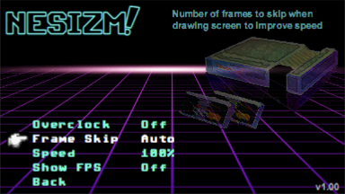

  

# NESizm v 0.95
NESizm is a Nintendo Entertainment System emulator for the Casio Prizm series of graphics calculators. It currently supports the FX-CG20 and FX-CG50. NESizm was built from the ground up with performance in mind, while maintaining accurate emulation and compatibility wherever possible with clever caching, forced alignment, and hand written assembly where necessary. It runs most titles at 60 FPS with no overclocking on the FX-CG50.

This project has its roots in my interest in early game development technology, as well as the inherent benefits of the Prizm as a platform. There is a large install base of players who can now play NES over 100 hours of battery life with 0 input lag from keyboard to display.

## Install

Copy the nesizm.g3a file (or nesizm_cg10.g3a if you have an FX-CG10) to your Casio Prizm calculator's root path when linked via USB. NES roms (.nes) also should go inside of the root directory. The filenames for these files should be simple and less than 12 characters, such as MyGame.nes. The emulator does not support the NES 2.0 ROM format, so stick with old style roms for now.

## Usage

### Menu

In the menu system use the arrow keys and SHIFT or ENTER to select.

When inside a game, the MENU key will exit to the settings screen, and pressing MENU again will take you back to the calculator OS.

### In Game

You can configure your own keys in the Settings menu, these are the default I found to work well:

- Dpad : Dpad
- A: SHIFT
- B: OPTN
- Select: F5
- Start: F6
- Turbo A: Alpha
: Turbo B: X^2
- Save State : X (multiply), which is the alpha 'S' key for save
- Load State : -> (store), which is the alpha 'L' key for load
- Fast Forward: ^ (caret), runs CPU at full speed running rendering every 8th frame, about 3x speed
- Volume Up: + (plus), increases the volume, though at the maximum level this will cause more distortion
- Volume Down - (minus), decreases the volume, though at lower levels it will have more scratchiness and lower accuracy

Note that if you set the turbo setting to 30 Hz, this may be too fast for some games causing them to malfunction.

### Screen Stretch

I added a screen stretching option that utilizes the high refresh rate of the screen to interlace the signal, which is very similar to how old interlaced TVs work. This works out with the TFT color screen, which has a slight color latency on the Prizm, to be very difficult to notice. If you set the Stretch option to 4:3, it will very closely match the proportions intended for the original games. However, it requires a high FPS. So the emulator visuals will start to look glitchy if you have a very high frameskip option set. In general, setting your options to a very high frameskip should be unnecessary. The calculator battery life does not appear to be heavily effected by frame skip. 

### Two Players

If you desire to play with a second controller, it can be mapped to other buttons on the calculator using the Remap Buttons option in Options->Controls. This is very cumbersome, however, so by default Player 2 is not mapped to any buttons.

### Save States
 
A single save state is supported per ROM, which can be loaded/saved using the remappable keys mentioned in the Controls section. These default to the 'S' and 'L' keys on the calculator. The save state file will be saved to your main storage with the .fcs extension.

These save states are generally intercompatible with FCEUX, the popular PC NES emulator. However, by default, FCEUX enables compression on its save states when saving, so in order to transport a save state back to your calculator, you need to disable save state compression in FCEUX.

### Battery Backed Support

If a ROM uses a battery backed feature, such as Legend of Zelda, this memory will automatically be saved when you return to the main menu with the MENU button. Keep in mind that using save states will completely overwrite the battery backed data.

## Support

The emulator now plays over 90% of the games I have been able to test smoothly at this point. Currently only a few fringe titles have significant visual artifacts.

Here is the current mapper support table, in which I am only including mappers I intend to implement. Eventually, the emulator will have ~97% coverage of all games released based on this list.

Mapper Name | Working | % | Name | Working | % | Name | Working | %
-|-|-|-|-|-|-|-|-
**MMC3** | Yes| 27.3%     | MMC5 | No | 0.7%             | FFE F8xxx | No | 0.6%
**MMC1** | Yes | 28.4%    | **Camerica** | Yes | 0.7%        | FFE F4xxx | No | 0.5%
**UNROM** | Yes | 13.0%   | **MMC2** | Yes | 0.2%            | 74161/32 | No | 0.5%
**NULL** | Yes | 8.9%     | Nanjing | No | 0.05%         | AVE | No | 0.5%
**AOROM** | Yes | 2.7%    | Bandai | No | 1.1%           | TC0190 / TC0350 | No | 0.4%
**CNROM** | Yes | 7.8%    | **Colour Dreams** | Yes | 1.0%   | Sunsoft 5 | No | 0.4%
**Rambo-1** | Yes | 0.1%    | Namcot 106 | No | 1.0%       | VRC2B | No | 0.3%
**MMC6** | Yes | 0.1%     | SS8806 | No | 0.6%           | Nina-1 | No | 0.3%

A full table of ROMs and mappers can be found here, but I don't keep it entirely up to date:
https://docs.google.com/spreadsheets/d/1TfgiU6doDaGvIzSMY3flPSmZviFKiysoxi9uwl-RlRY/edit?usp=sharing

### PAL Titles

 

PAL ROMS run at a different frame rate of 50 Hz compared to games from the USA and Japan (NTSC) which run at 60 Hz. This, plus a few other timing differences means they needs to be emulated differently. Unfortunately, most ROM files for PAL games do not accurately identify themselves as requiring PAL emulation. With NESizm, you can properly run a PAL game by including PAL (ALL CAPS) in the ROM filename, such as GamePAL.nes

### Sound

The emulator has full support for sound. In fact, the sound is an extremely fine tuned algorithm for 1 bit sound being adjusted over 500,000 times a second at fairly low performance hit. Enable it in the sound menu in the options. In order to use it, you'll need a 2.5 mm (male) to 3.5 mm (female) adaptor. These can be found for a couple bucks at various online vendors, nothing fancy needed!

An additional quality option is available that is more of a subjective thing. The quality option will decrease the triangle and noise wave generators based on the DMC generator just like the original NES, and adds an extra low pass filter to avoid quick shifts. In practice with one-bit sound though, it doesn't appear to be enormously important.

## Building

My other repository, PrizmSDK, is required to build NESizm from source. Put your NESizm clone in the SDK projects directory.

To build on a Windows machine, I recommend using the project files using Visual Studio Community Edition, where I have NMAKE set up nicely. For other systems please refer to your Prizm SDK documentation on how to compile projects. Refer to the configuration options in make-DeviceRelease.bat.

If you do use Visual Studio, a project is included that uses a Windows Simulator I wrote that wraps Prizm OS functions so that the code and emulator can easily be tested and iterated on within Visual Studio. See the prizmsim.cpp/h code for details on its usage.

## Special Thanks

The Nesdev wiki, found at http://wiki.nesdev.com/ was incredibly useful in the development of NESizm. My sincerest gratitude to the community of emulator developers who collected all of the information I needed to write an emulator in a single place.

FCEUX, found at http://www.fceux.com provided great debugging tools that allowed me to compare and contrast my emulator state easily for games that had compatibility issues. Show them some love by using their emulator on PC!